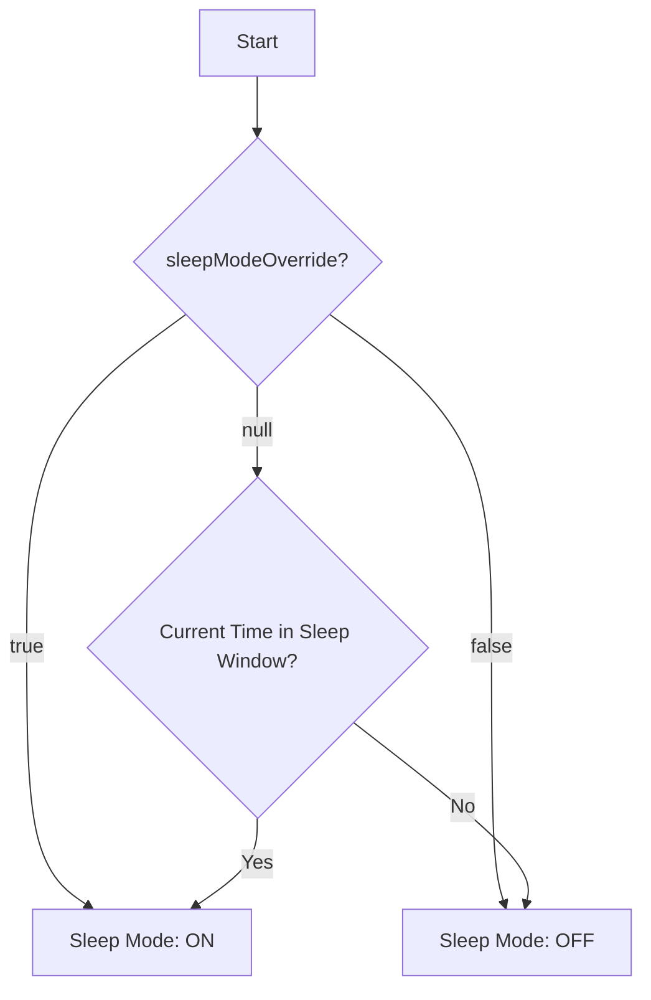

# Design: Split Control Panel State Logic

## Current State
Single variable `userModeOverride`: `null` | `'light'` | `'dark'` | `'sleep'`.
Combined logic determines `currentDisplayMode`.

## New State Architecture
Separating concerns into two state variables:

1.  **`displayModeOverride`** (`DisplayModeState`)
    *   Values: `null` (Auto), `'light'`, `'dark'`
    *   Controls: Color scheme preference.

2.  **`sleepModeOverride`** (`SleepModeState`)
    *   Values: `null` (Auto), `true` (On/Force Sleep), `false` (Off/Force Awake)
    *   Controls: Sleep behavior (black screen, AI advice).

## Logic Flow

### 1. Determine `isSleepMode` (Boolean)
Priority calculation for Sleep Mode:


### 2. Determine `currentDisplayMode` (Visual)
Priority calculation for final visual mode:
```mermaid
graph TD
    A[Start] --> B{isSleepMode?}
    B -- Yes --> C[Visual: SLEEP (Black)]
    B -- No --> D{displayModeOverride?}
    D -- Light --> E[Visual: LIGHT]
    D -- Dark --> F[Visual: DARK]
    D -- null --> G{Sun/Time Logic}
    G -- Day --> E
    G -- Night --> F
```

## UI Components
*   **Button A (Display)**: Toggles `displayModeOverride` (`null` -> `'light'` -> `'dark'` -> `null`).
*   **Button B (Sleep)**: Toggles `sleepModeOverride` (`null` -> `true` -> `false` -> `null`).

## Interactions
*   When `isSleepMode` is true, the UI is effectively black. Button A is still clickable and changes `displayModeOverride`, but the visual result remains "SLEEP" until Sleep Mode is exited.
*   (Optional but recommended) Button A visually indicates it's suppressed or secondary when Sleep Mode is active, but user requirements say "visually maintain pitch black" generally for the UI, but buttons might still be visible (development toolbar). The requirement says "Button A behavior: Display Mode button can still be clicked... but visually the interface remains pitch black".
